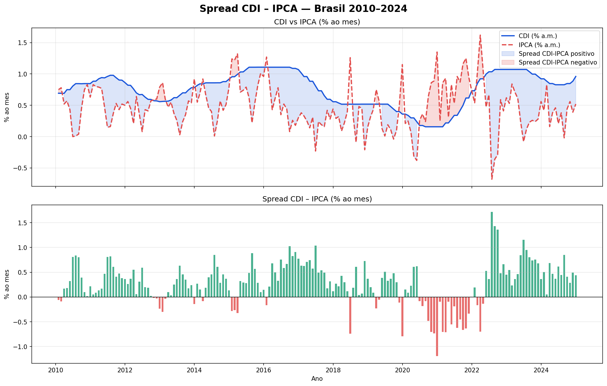
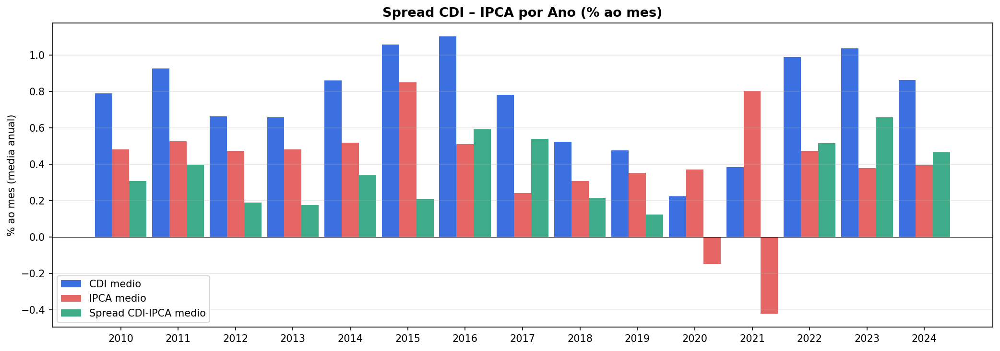
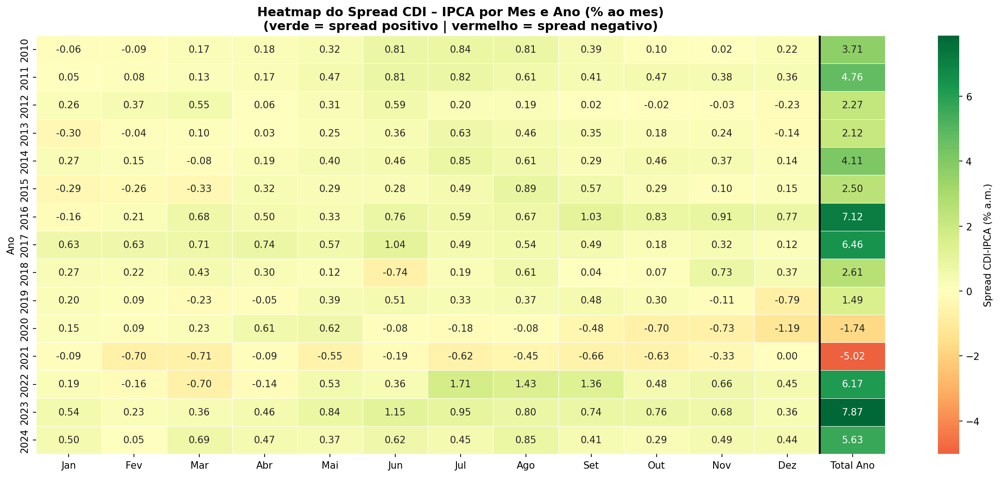

# Spread CDI – IPCA (2010–2024)

## Sobre o projeto
Análise mensal do spread entre CDI e IPCA no mercado brasileiro usando dados públicos do Banco Central (SGS). O projeto calcula o spread CDI–IPCA mês a mês de 2010 a 2024, identifica os ciclos de maior e menor atratividade para o investidor em renda fixa e gera três visualizações: evolução temporal, comparativo anual e heatmap mensal com total acumulado por ano.

## Pergunta de negócio
*Em quais períodos o spread CDI–IPCA foi mais favorável ao investidor em renda fixa, e o que explica essas variações?*

## Principais insights
- O spread se manteve positivo em 78,3% dos meses do período analisado
- Os melhores anos foram 2016 e 2023, com spread acumulado anual de 7,12% e 7,87% respectivamente
- O pior período foi 2020–2021, únicos anos com spread acumulado negativo (-1,74% e -5,02%)
- O pior mês foi dezembro/2020: spread de -1,193% a.m., com CDI em 0,157% e IPCA em 1,35%

## Visualizações




## Stack
Python · pandas · matplotlib · seaborn · requests · API SGS/BCB

## Como rodar
```bash
pip install pandas matplotlib seaborn requests
jupyter notebook projeto1_bcb_v5.ipynb
```

## Autor
Lucas Abreu · [LinkedIn](https://www.linkedin.com/in/lucas-vieira7x)
