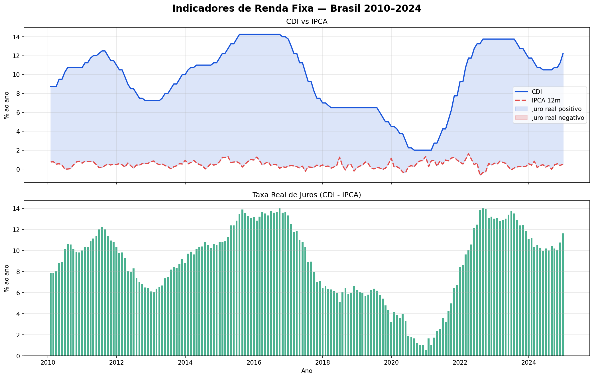
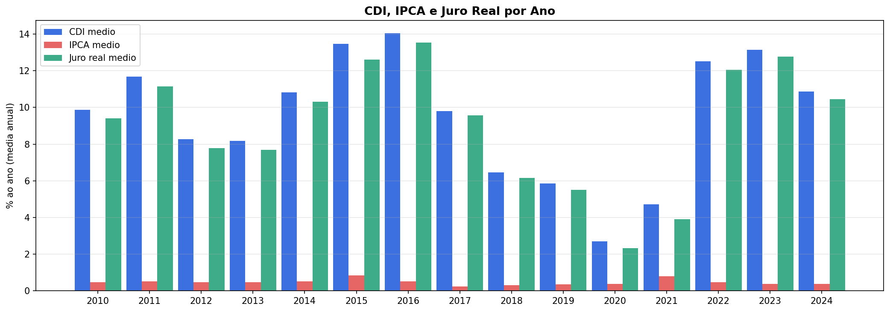
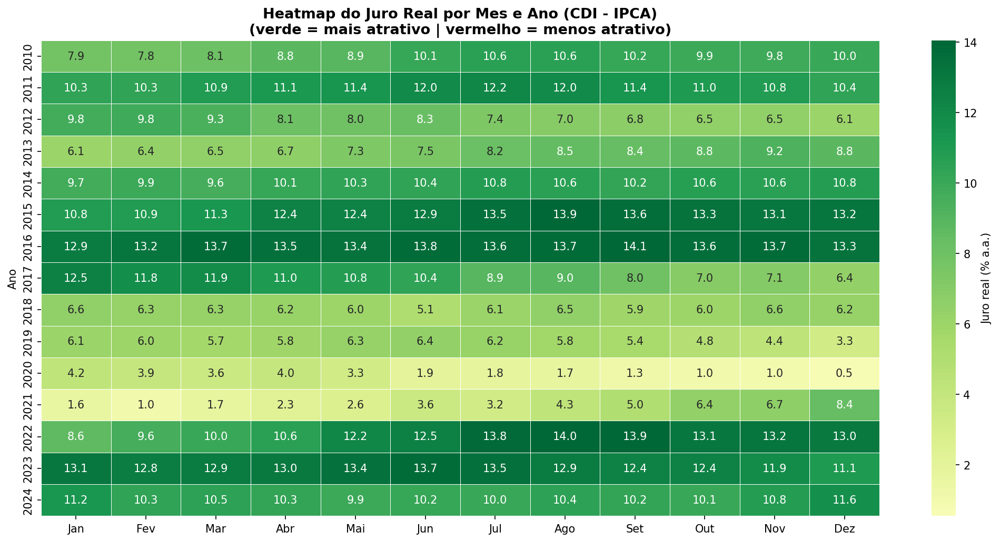

# Análise de Juro Real Brasileiro — BCB (2010–2024)

## Sobre o projeto
Análise exploratória de indicadores de renda fixa brasileiros utilizando dados públicos 
do Banco Central do Brasil (SGS). O projeto investiga a evolução do juro real (CDI - IPCA) 
ao longo de 15 anos, identificando os ciclos de maior e menor atratividade para o investidor.

## Pergunta de negócio
*Em quais períodos o juro real foi mais atrativo para o investidor em renda fixa, 
e o que explica essas variações?*

## Principais insights
- O juro real se manteve positivo em todos os meses do período analisado
- Os picos de atratividade foram em 2015–2016 e 2022–2023, com juro real médio acima de 13% a.a.
- O período mais desafiador foi 2020–2021, com juro real mínimo de 0,5% a.a.
- O heatmap revelou padrão assimétrico em 2021: juro real saiu de 1,6% em janeiro para 8,4% em dezembro

## Visualizações




## Stack
Python · pandas · matplotlib · seaborn · requests · API SGS/BCB

## Como rodar
```bash
pip install pandas matplotlib seaborn requests
jupyter notebook projeto1_bcb.ipynb
```

## Autor
Lucas Abreu · [LinkedIn](https://www.linkedin.com/in/lucas-vieira7x)
